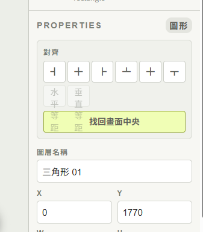

# 審核原則

每項滿分 100 分，所有項目都必須達到 90 分；平均分不能抵銷未達標項目。

## [criterion:C1] 物件位置與拖曳生命週期

### Requirements / 要求

- 已聚焦的數字輸入欄收到滾輪時必須先失焦，讓右欄繼續捲動而不改變 X／Y 等數值。
- pointerup 在視窗任意位置都能完成拖曳；pointercancel、視窗失焦或頁面隱藏必須取消預覽並清理拖曳／平移狀態。
- 輕點仍不得建立拖曳歷史，正常拖曳仍只建立一筆 Undo。

### Score anchors / 評分錨點

- 95–100：數字滾輪與所有中斷路徑均有集中式保護及直接測試，正常拖曳語意完整。
- 90–94：主要誤移路徑均被阻斷且回歸測試通過，僅缺少非關鍵瀏覽器實機證據。
- 70–89：只修數字欄或拖曳其中一條路徑，仍有可重現殘留狀態風險。
- 40–69：物件仍可能因右欄滾動或遺失 pointerup 明顯跳位。
- 0–39：拖曳或欄位編輯無法使用。

### Required evidence / 必須證據

- 指出數字輸入滾輪判斷與右欄事件綁定。
- 指出 pointerup／pointercancel／blur／visibilitychange 的處理差異。
- 提供互動數學與靜態整合測試。

## [criterion:C2] Scene 縮放連續性

### Requirements / 要求

- 每一個 Ctrl＋滾輪事件都以同步 ref 中的最新比例計算，不得依賴可能過期的 render closure。
- 密集同方向事件必須連續累加，反方向事件必須從當下比例回復一階；25%–250% 邊界與滑鼠錨點保持不變。
- 普通滾輪、畫布平移與 Undo 紀錄語意不得被改變。

### Score anchors / 評分錨點

- 95–100：最新值同步、連續序列、邊界與錨點均有直接證據及測試。
- 90–94：核心跳回原因已排除，既有縮放與平移測試全數通過。
- 70–89：縮放可用但仍使用過期 closure，或缺少連續事件證據。
- 40–69：縮放仍會跳回、吃掉事件或改動瀏覽器縮放。
- 0–39：Ctrl＋滾輪縮放失效。

### Required evidence / 必須證據

- 指出 `sceneZoomRef` 的同步、讀取與立即寫回位置。
- 提供連續滾輪序列測試與既有錨點測試。
- 確認 native wheel listener 仍為 non-passive 並呼叫 preventDefault。

## [criterion:C3] 找回中央座標正確性

### Requirements / 要求

- 一般物件必須置於 Scene 幾何中央。
- 寬或高超過 Scene 的物件必須先縮至 Scene 範圍，再依縮後尺寸置中，不得落在底部或右側。
- 結果必須保持有限數值並位於 Scene 範圍內。

### Score anchors / 評分錨點

- 95–100：一般、超寬、超高與雙向超尺寸均有精確座標測試。
- 90–94：算法順序正確且至少涵蓋一般與超尺寸案例。
- 70–89：一般案例正確，但超尺寸仍先算位置後縮放。
- 40–69：找回按鈕可能把物件放到邊界或畫布外。
- 0–39：找回中央功能失效或破壞物件。

### Required evidence / 必須證據

- 指出定位算法中的尺寸正規化與置中順序。
- 提供輸入與預期 transform 的單元測試。

## [criterion:C4] 大字級屬性面板版面

### Requirements / 要求

- 六個對齊按鈕、兩個等距按鈕與找回中央必須分成明確三列，不得重疊或互相遮蔽。
- 所有按鈕維持至少 36px 高及 12px 以上文字／符號，右欄寬度不額外膨脹。
- disabled、可點擊狀態及原有 align／distribute／locate handler 保持完整。

### Score anchors / 評分錨點

- 95–100：三列結構明確、間距舒適，狀態與 handler 有直接證據。
- 90–94：不再重疊且操作完整，僅缺少實機 Chrome 截圖。
- 70–89：主要重疊改善但仍有裁切、擠壓或固定高度衝突。
- 40–69：截圖中的重疊仍存在或按鈕無法點擊。
- 0–39：屬性面板不可使用。

### Visual references / 圖文參考

此圖是不合格例；比較對齊、等距與找回中央三區是否互相覆蓋。只參考問題區域，不模仿截圖寬度或裁切。

### Required evidence / 必須證據

- 指出 JSX 的三個專用 row class 與 CSS grid 規則。
- 指出按鈕最小高度與字級來源。
- 確認所有原 handler 與 disabled 條件仍存在。

## [criterion:C5] 全專案回歸與交付

### Requirements / 要求

- TypeScript/build、完整測試、PSD 驗證、Lint、效能基準全部通過。
- Ctrl＋滾輪、雙軸平移、拖曳門檻、流程卡連線與大字級測試仍通過。
- 版本資料一致，差異只包含本次修正、測試、文件與審核資料。

### Score anchors / 評分錨點

- 95–100：所有客觀檢查通過，測試直接覆蓋四項根因與既有核心互動。
- 90–94：全部檢查通過且主要回歸受保護，只有非關鍵人工證據缺口。
- 70–89：有未通過或未執行的核心檢查。
- 40–69：建置、Lint、PSD 或核心互動測試失敗。
- 0–39：無法建置或交付物缺失。

### Required evidence / 必須證據

- 列出測試數、Lint、PSD 與 benchmark 結果。
- 指出版本與 Git 差異範圍。
- 指出舊功能保護測試位置。

# 一票否決條件

- 交付物無法建置，或物件仍能因右欄滾輪直接改變位置數值。
- Scene Ctrl＋滾輪仍從過期縮放值計算。
- 對齊、等距或找回中央任一操作被遮蔽或失效。
- 任一審核項目低於 90 分。
